# PathwayMapper

PathwayMapper is a web based pathway curation tool for interactive creation, editing, and sharing of cancer pathways. The tool supports remote users to collaborate and concurrently modify pathways using [ShareDB](https://github.com/share/sharedb) with built-in conflict resolution implemented as a [ReactJS](https://reactjs.org/) component.
<p align="center">
  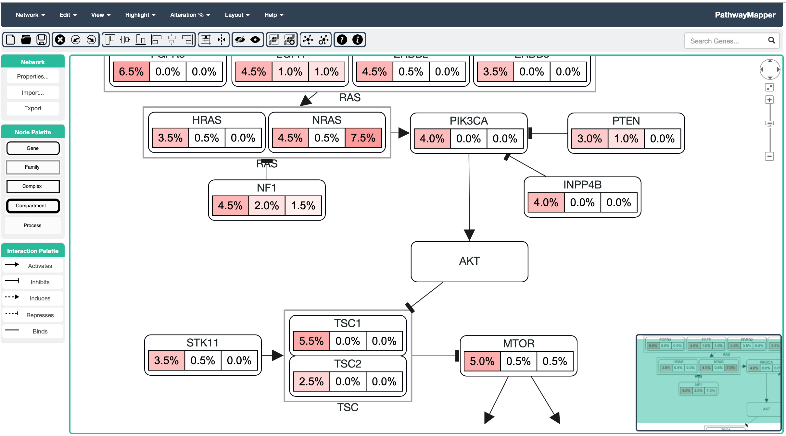
</p>

A special, viewer edition of PathwayMapper was built for use in cBioPortal ([example](https://www.cbioportal.org/results/pathways?Action=Submit&Z_SCORE_THRESHOLD=1.0&cancer_study_id=gbm_tcga_pub&cancer_study_list=gbm_tcga_pub&case_set_id=gbm_tcga_pub_sequenced&gene_list=TP53%20MDM2%20MDM4&gene_set_choice=user-defined_list&genetic_profile_ids_PROFILE_COPY_NUMBER_ALTERATION=gbm_tcga_pub_cna_rae&genetic_profile_ids_PROFILE_MUTATION_EXTENDED=gbm_tcga_pub_mutations), [tutorial](https://www.cbioportal.org/tutorials)).
<p align="center">
  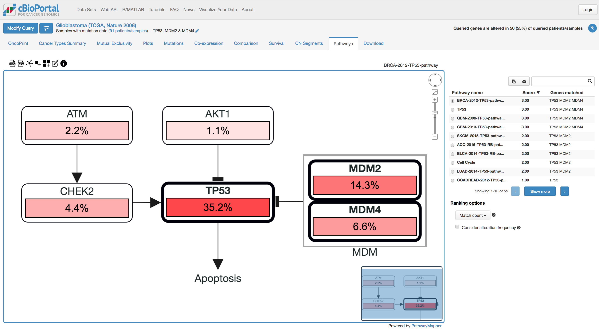
</p>

Below is a video tutorial on basics of PathwayMapper:
<a href="https://youtu.be/jvEueUqZZPI" target="_blank"><p align="center">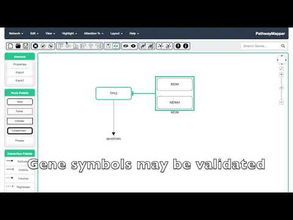</p></a>

#### How to Cite Usage
Bahceci et al. (2017) "[PathwayMapper: a collaborative visual web editor for cancer pathways and genomic data](https://doi.org/10.1093/bioinformatics/btx149)", Bioinformatics.

#### Feedback
Send any feedback and error reports to at pathwaymapper@gmail.com.

## Software

PathwayMapper is distributed under [GNU Affero General Public License](https://www.gnu.org/licenses/agpl-3.0.html).

A sample deployment can be found [here](http://pathwaymapper.org).

<!---
To run the clone of the project in your computer, run:
```
sudo npm run-debug build
```
This launches the application on port 80 if it is not in use.
--->

#### Running a Local Instance
In order to deploy and run a local instance of the tool, please follow the steps below:

Firstly, clone PathwayMapper to your local machine, and navigate to the local repository:

- Installation
```
git clone https://github.com/iVis-at-Bilkent/pathway-mapper.git
cd pathway-mapper
yarn install
```

- Running the tool
```
yarn start
```

Please note that the app runs on port 3000 by default. To change the port, set the port environment variable before running npm start:
```
export PORT=3000
yarn start
```
Windows users need to change the associated variable in server.js file:
```
const DEFAULT_PORT = 3000;
```

#### Running an instance on Heroku (free)
[](https://heroku.com/deploy)

#### Running Tool in Development Mode
Running the tool in development mode does not require any changes.

Just make sure that after you made your changes, execute the below command to start build process:

```
yarn build
```

Then, it can be run using `yarn start`.

Please note that the app runs on the port 3000 by default. To change the port follow the same steps in previous section.

## Sample TCGA Pathways

A number of pathways from the manuscripts of The Cancer Genome Atlas (TCGA) studies and those resulting from TCGA PanCanAtlas Project are available under Network > TCGA menu items sorted alphabetically by cancer type or pathway name. For instance, following is the PI3K pathway in Glioblastoma:
<p align="center">
  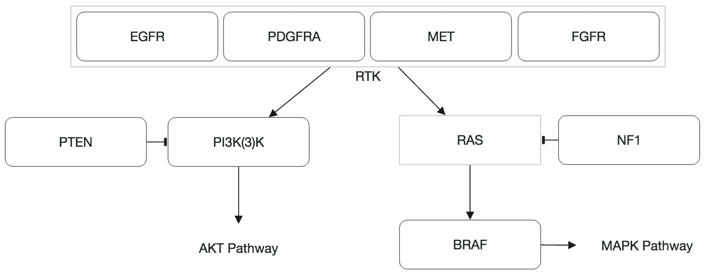
</p>

The same pathway can be opened up in PathwayMapper with URL <a href="http://pathwaymapper.org/?pathwayName=GBM-2013-RTK-RAS-PI(3)K-pathway" target="_blank">http://pathwaymapper.org/?pathwayName=GBM-2013-RTK-RAS-PI(3)K-pathway</a>, where pathwayName is the title of the sample pathway in PathwayMapper.

## Adding Genes and Interactions

PathwayMapper allows creation of following node types:
- Gene
- Family: subset of genes grouped together under a parent compound node for analysis purposes
- Complex: molecular complex of member genes represented with a parent compound node
- Compartment: a cellular location for genes and interactions represented with a parent compound node
- Process

and following interaction types:
- Activates
- Inhibits
- Induces (transcriptional activation)
- Represses (transcriptional inhibition)
- Binds

To create a node, drag and drop it from the Node Palette. Similarly, to create an interaction, first select an interaction type from the Interaction Palette. Then, click on the green circle on top of the source node and drag it to the target node.

To add a node inside a compound node, you may directly drag it from the palette onto the parent compound node. Alternatively, you may select the node(s) and then right click on the compound to which you'd like to add the node and choose Add Selected Into This.

Below is a screenshot showing a sample pathway constructed with PathwayMapper:
<p align="center">
  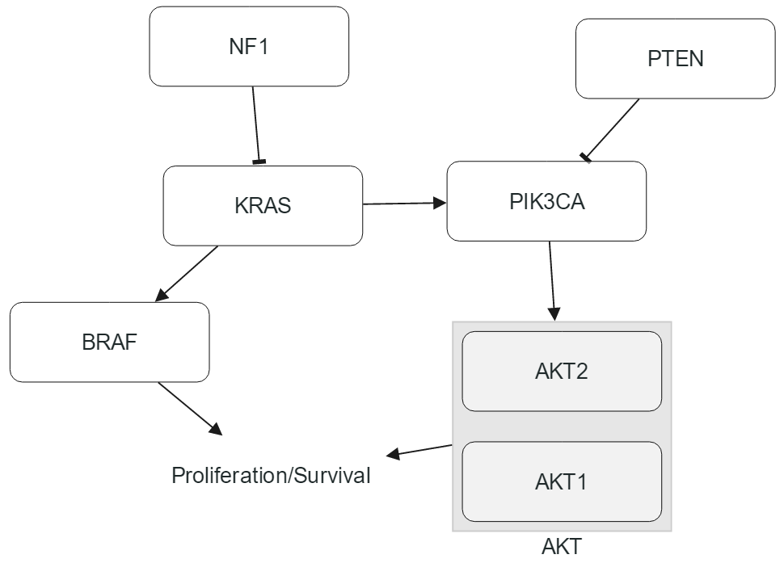
</p>

### Validating Gene Symbols

Gene symbols may be checked for validity using [cBioPortal's web service](https://www.cbioportal.org/api/genes/fetch). Below is a screenshot showing genes with invalid labels in red borders:
<p align="center">
  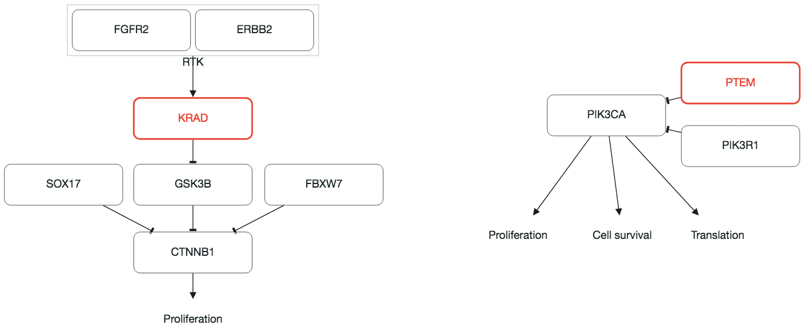
</p>

### Inspecting Gene Properties

Assuming a gene symbol is valid, you may inspect its properties from [MyCancerGenome](https://www.mycancergenome.org/) by simply double-clicking on that gene and pressing the button "MyCancerGenome". This will display the associated gene page in a new browser tab:
<p align="center">
  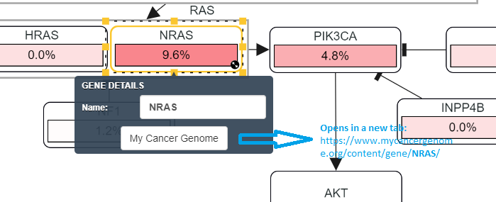
</p>

### Associating PubMed IDs with Interactions

One can associate any number of PubMed IDs with an interaction by simply double-clicking on that interaction and entering the PubMed IDs. These IDs have hyperlinks to the associated PubMed web page:
<p align="center">
  
</p>

## Editing Pathways

### Editing and Aligning Nodes

Node locations may be adjusted manually by clicking on / selecting and dragging them. Multiple nodes may be selected by either using Shift + click or by Shift and box selection.

Nodes may be resized manually using the resize handles that appear on the edge of the node borders upon selection. Alternatively, the visual cue that appear toward the lower right corner of a node may be clicked to resize it to content (label and experiment data). All nodes may be simulatenously resized to their content via Edit > Resize Nodes to Content.

Alignment guidelines help us align nodes manually in a vertical or horizontal manner. Alternatively, one may select two or more nodes and align using View > Align Selected menu item. Alignment is performed with respect to the firstly selected node.

Before vertical center alignment of four nodes with respect to the firstly selected gene KRAS:
<p align="center">
  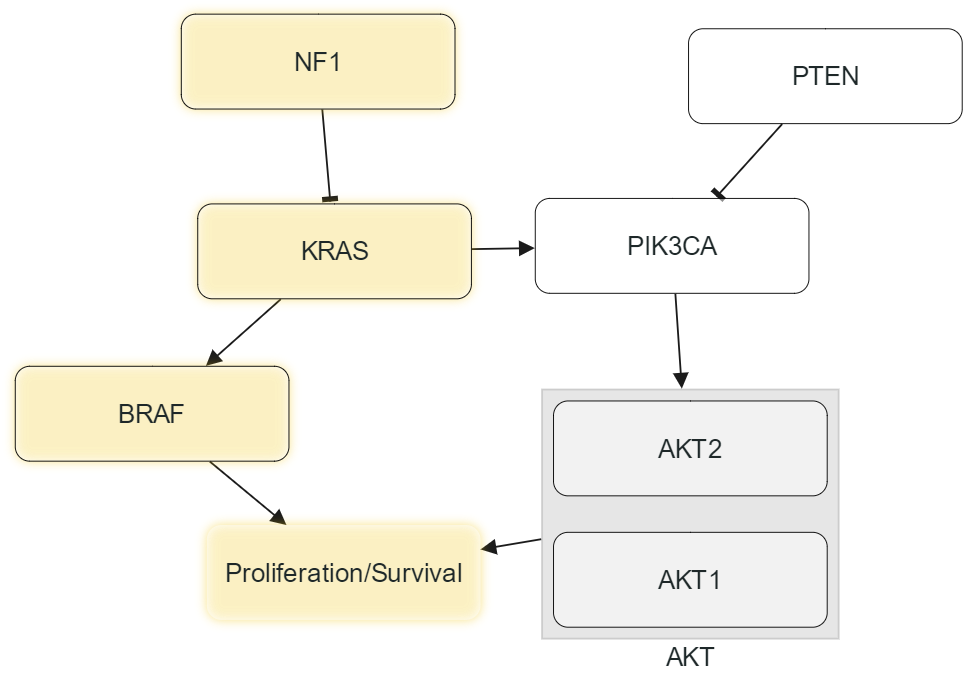
</p>

After alignment:
<p align="center">
  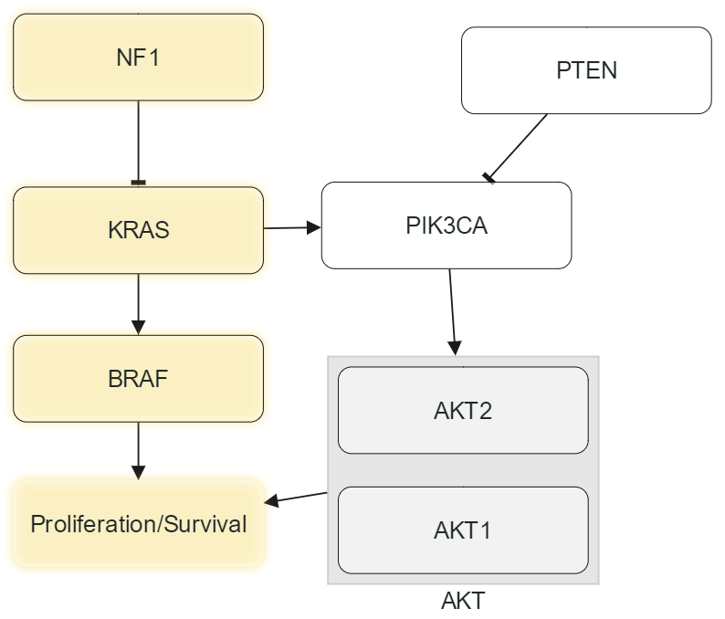
</p>

### Editing and Reconnecting Interactions

Interactions may be routed through additional bend points. To introduce a new bendpoint, first select the interaction by clicking on it, and then click and drag at a location where you'd like to introduce a bendpoint. Bendpoints may be moved by clicking on them and drag them. In order to remove a bendpoint, move it to a location where it becomes almost unnecessary (it falls onto a straight line).

One may also reconnect an interaction through its reconnection handles that appear when the edge is selected. Simply click on the reconnection handle close to the source / target that you'd like to change and drag it onto the new source / target.

### Performing Automatic Layout

At any point, the user may want to rearrange the layout of the pathway. By default, automatic layout is performed incrementally, starting with the current positions of nodes. If you'd rather perform a static layout from scratch, you may check the Incremental option under Layout > Layout Properties.

A pathway randomly laid out:
<p align="center">
  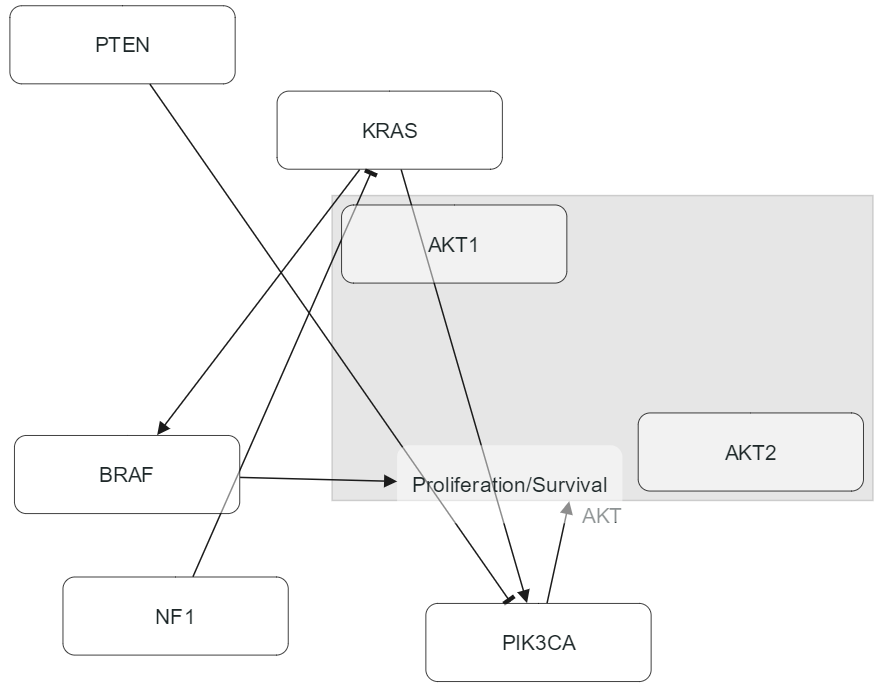
</p>

The same pathway after automatic layout:
<p align="center">
  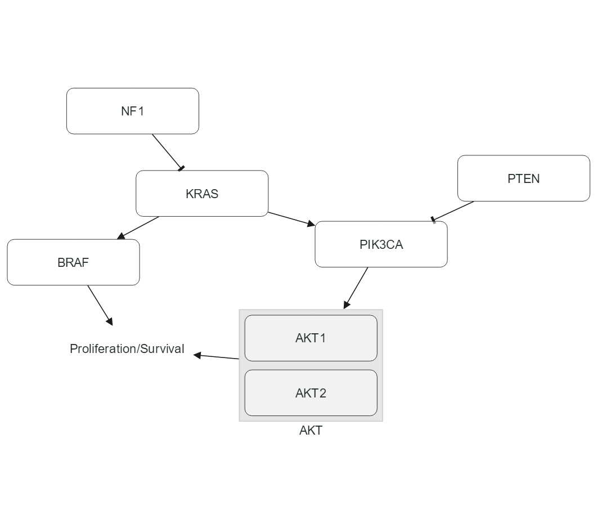
</p>

### Hide and Show

Certain parts of a pathway may be temporarily removed by selecting and choosing View > Hide Selected Nodes. Nodes hidden in this way may be collectively brought back into the view using View > Show All Nodes.

### Highlight

Nodes and interactions may be highlighted to draw attention to certain paths or sub-pathways by simply selecting them and applying Highlight > Highlight Selected. 

One may use Highlight > Identify Invalid Genes to highlight all genes with symbols that are not valid. 

All such highlights can be removed at once by issuing Highlight > Remove All Highlights.

### Undo / Redo

All editing operations explained earlier may be undone and redone if needed using Edit > Undo or Redo. Undo, however, is not available in Collaborative mode (see below).

## Export and Import

### Exporting To / Importing From A Text File

The user may persist the current pathway onto the disk and import it back later on. Pathway content is organized as follows in a tab-delimited text file:
```
PTEN and the PI3-Kinase Pathway

This pathway ...

--NODE_NAME	NODE_ID	NODE_TYPE	PARENT_ID	POSX	POSY--
PTEN	PTEN	GENE	-1	444	46	
PIK3CA	PIK3CA	GENE	-1	360	139	
...

--EDGE_ID	SOURCE	TARGET	EDGE_TYPE
PTEN-PIK3CA	PTEN	PIK3CA	INHIBITS
...
```

Here the first line contains the pathway title followed by a single empty line. Then comes a description of the pathway, again followed by a single empty line. After that comes nodes with properties name, ID, type, parent ID, x, and y positions, where parent ID and location information are optional. This is succeeded with a single empty line, followed by edges with properties ID, source ID, target ID, and type.

### Exporting As Image

The user may export the current pathway as a static image (JPG and PNG) or in scalable vector graphics (SVG).

## Viewing Experiment Data

At any point during pathway editing, the user may upload and overlay an associated experimental data set from a text file.

The tab-delimited experiment data files are organized as follows, where after the gene name one or more data sets follow:
```
gene	lung	ovarian	breast
PTEN	-7	-20	10
PIK3CA	18	40	-50
...
```

Here positive value signify activation percentage and are shown with a white-red color scale, whereas negative values signify inactivation shown with a white-blue color scale. The experiment file may contain an arbitrary number of data sets, and its view can be customized through Alteration % > Data View Settings dialog.

Below is a screenshot showing sample experiment data overlaid on our sample data:
<p align="center">
  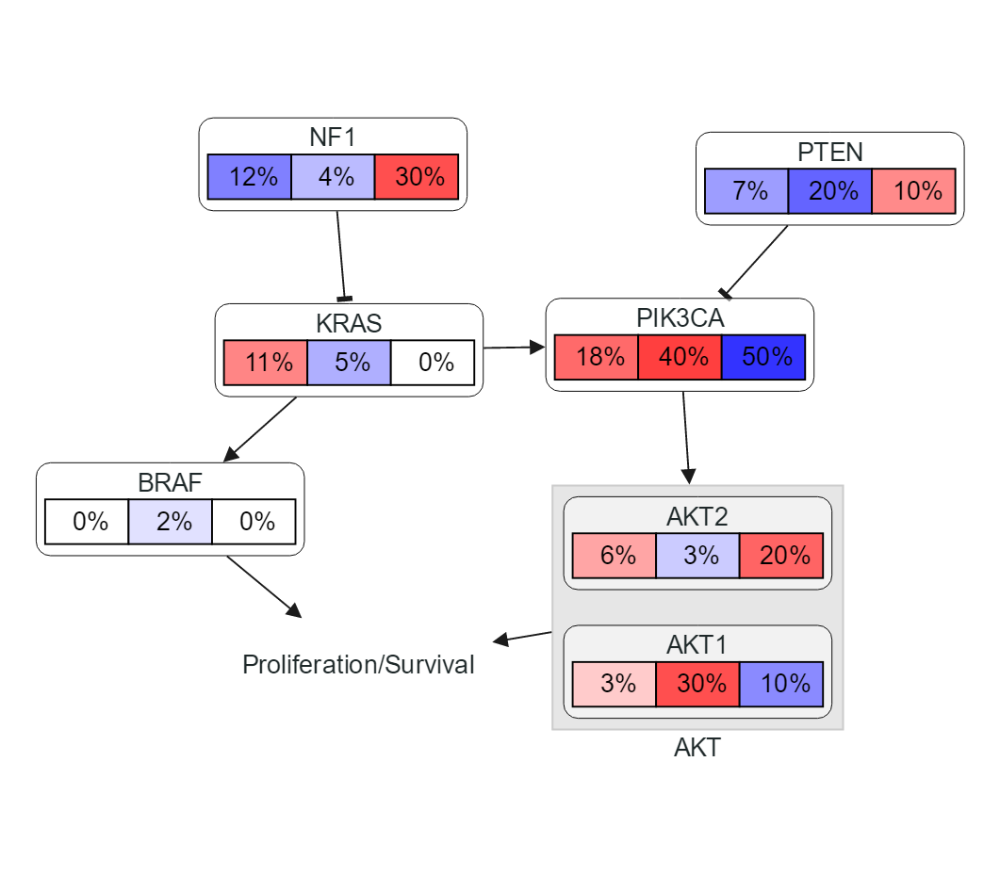
</p>

When the user unchecks the experiment data for "lung" through Alteration % > Data View Settings (first of the set of three), we get:
<p align="center">
  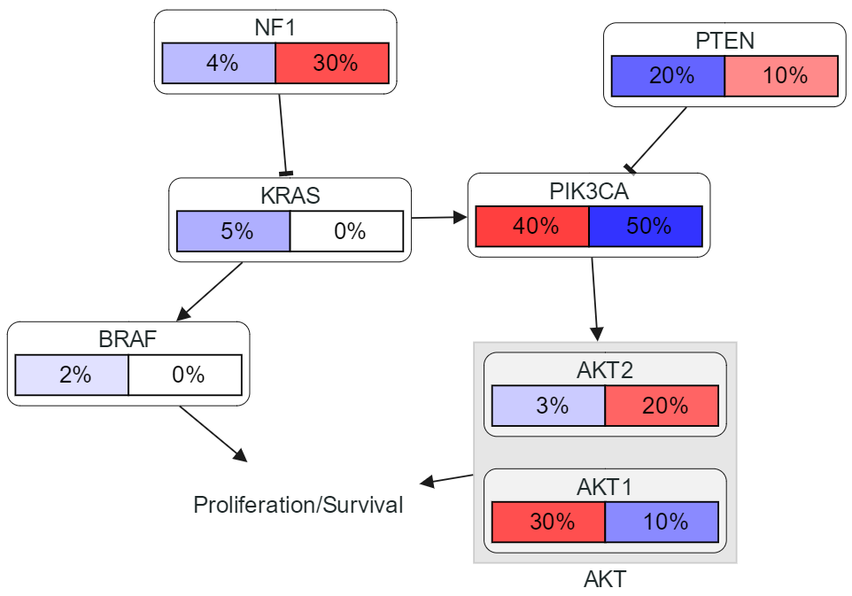
</p>

The user may also fetch alteration frequencies available on cBioPortal database through Alteration % > Load from cBioPortal... dialog. The dialog will let the user select a cancer study followed by data type(s) available for that studey in the database, and overlay the related data set(s) on the pathway in addition to any currently available data set.
<p align="center">
  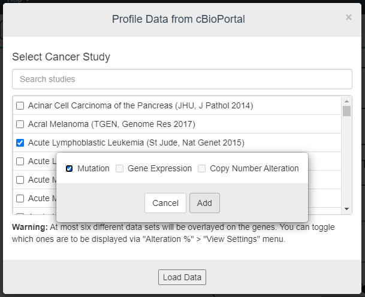
</p>

## Collaborative Editing

Should you choose "Collaborative" on the welcome page, you will be first prompted for Google account authentication since the shared data model will be stored in a shared document at Google Drive folder of the user. Then your editing session will be given a unique ID and you will have the option of sharing the URL containing this ID with desired person(s) and construct / edit a pathways in real time with support for concurrent modifications and built-in conflict resolution.

Any changes made by any person working on the pathway with the same URL will be shared / reflected to other people currently viweing / editing the same pathway. Below is a short video illustrating collaborative usage: 
<a href="https://youtu.be/peTbroPyrnw" target="_blank"><p align="center"></p></a>

## Credits

PathwayMapper uses many third party libraries mainly including [Cytoscape.js](http://js.cytoscape.org) and many of its extensions, [React](https://reactjs.org/), [Node.js](https://nodejs.org/), and [cBioPortal API](https://www.cbioportal.org/webAPI) licensed under BSD-2-Clause, BSD-3-Clause, ISC, Apache-2.0 or MIT. For a complete list, please refer to [this file](package.json).

Icons made by [Freepik](http://www.freepik.com), 
[Daniel Bruce](http://www.flaticon.com/authors/daniel-bruce), 
[TutsPlus](http://www.flaticon.com/authors/tutsplus),
[Robin Kylander](http://www.flaticon.com/authors/robin-kylander),
[Catalin Fertu](http://www.flaticon.com/authors/catalin-fertu),
[Yannick](http://www.flaticon.com/authors/yannick),
[Icon Works](http://www.flaticon.com/authors/icon-works),
[Flaticon](http://www.flaticon.com) and licensed with 
[Creative Commons BY 3.0](http://creativecommons.org/licenses/by/3.0/)

## Team

  * [Ziya Erkoc](https://github.com/Rgtemze), [Ugur Dogrusoz](https://github.com/ugurdogrusoz) of [i-Vis at Bilkent University](http://www.cs.bilkent.edu.tr/~ivis), [Ozgun Babur](https://github.com/ozgunbabur) of OHSU, and [S. Onur Sumer](https://github.com/onursumer), Konnor C. La, [Jianjiong Gao](https://github.com/jjgao), Nikolaus Schultz of [The Nikolaus Schultz lab at MSKCC](https://www.mskcc.org/research-areas/labs/nikolaus-schultz).

#### Alumni

  * [Kaan Sancak](https://github.com/kaansancak), [Leonard Dervishi](https://github.com/leonarddrv), and [Istemi Bahceci](https://github.com/istemi-bahceci)
