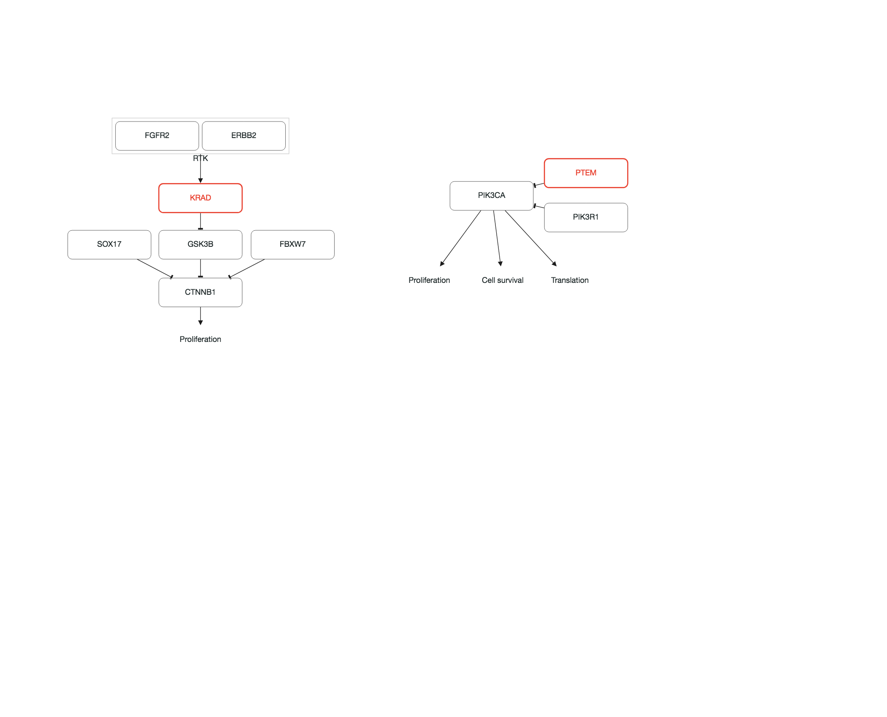
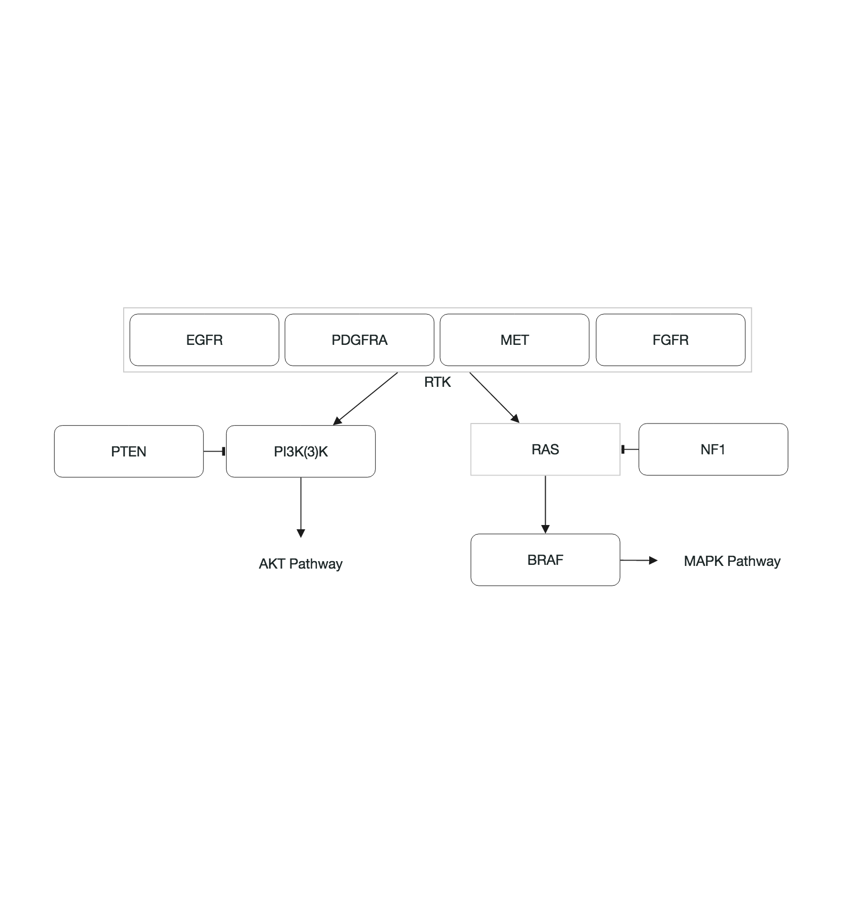
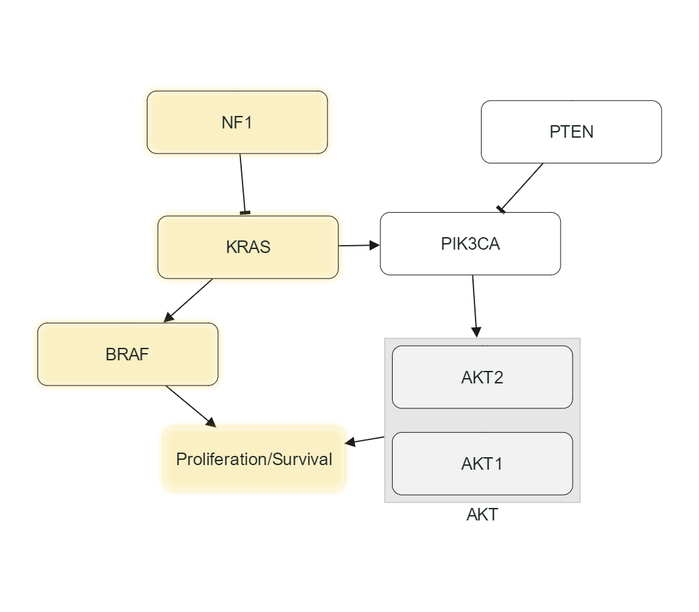
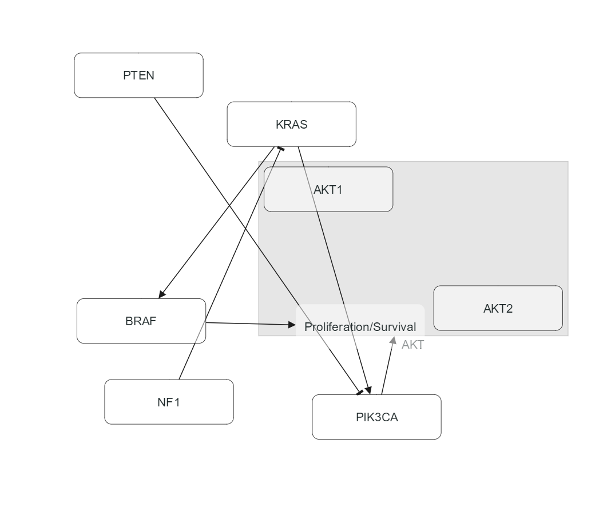
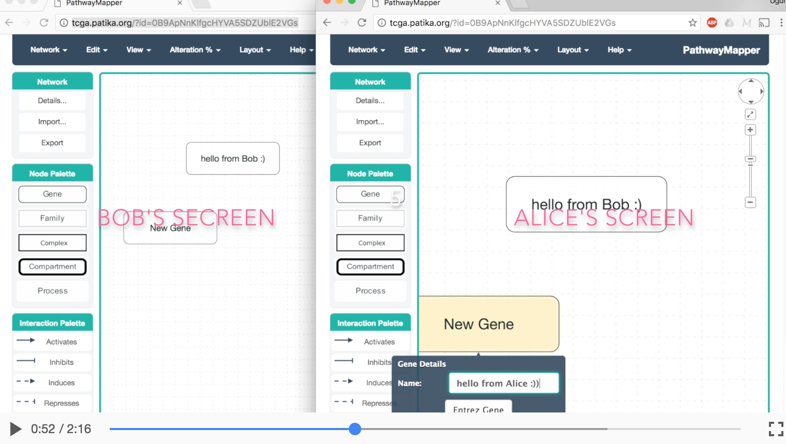

<!---
 TODO: search, highlight, node resize, edge bends
--->
# PathwayMapper

PathwayMapper is a web based pathway curation tool for interactive creation, editing, and sharing of cancer pathways. The tool supports remote users to collaborate and concurrently modify pathways using Google Real Time API with built-in conflict resolution. 
<p align="center">
  
</p>

#### How to Cite Usage
[Bahceci et al. (2017) "PathwayMapper: a collaborative visual web editor for cancer pathways and genomic data", Bioinformatics](https://academic.oup.com/bioinformatics/article-lookup/doi/10.1093/bioinformatics/btx149).

#### Feedback
Send any feedback and error reports to at pathwaymapper@gmail.com.
## Software

PathwayMapper is distributed under [GNU Affero General Public License](https://www.gnu.org/licenses/agpl-3.0.html).

It uses the libraries [Cytoscape.js](http://js.cytoscape.org), node.js, and backbone.js, and [cBioPortal API](http://www.cbioportal.org/api-legacy/swagger-ui.html). 

A sample deployment can be found [here](http://pathwaymapper.org).

<!---
To run the clone of the project in your computer, run:
```
sudo npm run-debug build
```
This launches the application on port 80 if it is not in use.
--->

#### Running a Local Instance
In order to deploy and run a local instance of the tool, please follow the steps below:

Firstly, clone PathwayMapper to your local machine, and navigate to the local repository:

- Installation
```
git clone https://github.com/iVis-at-Bilkent/pathway-mapper.git
cd patway-mapper
npm install
```
- Build
```
npm run build-min-js && npm run build-min-css
```

- Running the tool
```
npm start
```

Please note that the app runs on port 3000 by default. To change the port, set the port environment variable before running npm start:
```
export PORT=3000
npm start
```

Windows users need to change the associated variable in app.js file:
```
var DEFAULT_PORT=3000
```

#### Running an instance on Heroku (free)
[](https://heroku.com/deploy)

#### Running Tool in Developement Mode
In order to run a local instance of the tool in developement mode, please follow the steps below:

Firstly navigate to PathwayMapper repository. In index.html file uncomment the line with base.css and comment the line with base.min.css:
```
  <!--For debugging-->
  <!--<link rel="stylesheet" href="bin/base.css" charset="utf-8">-->
  <link rel="stylesheet" href="bin/base.min.css" charset="utf-8">
```

Similarly do the same for base.js and base.min.js file:
```
<!--For debugging-->
<!--<script src="bin/base.js"></script>-->
<script src="bin/base.min.js"></script>
```

After that run the tool with the following command:
```
sudo npm run debug-build
```

After tool runs, all of your changes on src folder will be reflected to tool that runs without need of re-deploying it. 

Please note that the app runs on the port 3000 by default. To change the port follow the same steps in previous section.

### Adding Genes and Interactions

PathwayMapper allows creation of following node types:
- Gene
- Family: subset of genes grouped together under a parent compound node for analysis purposes
- Complex: molecular complex of member genes represented with a parent compound node
- Compartment: a cellular location for genes and interactions represented with a parent compound node
- Process

and following interaction types:
- Activates
- Inhibits
- Induces (transcriptional activation)
- Represses (transcriptional inhibition)
- Binds

To create a node, drag and drop it from the Node Palette. Similarly, to create an interaction, first select an interaction type from the Interaction Palette. Then, click on the green circle on top of the source node and drag it to the target node.

Below is a screenshot showing a sample pathway constructed with PathwayMapper:
<p align="center">
  
</p>

#### Validating Gene Symbols

Gene symbols may be checked for validity using [cBioPortal's web service](http://www.cbioportal.org/beta/api/swagger-ui.html#!/Genes/getAllGenesUsingGET). Below is a screenshot showing genes with invalid labels in red borders:
<p align="center">
  
</p>

#### Inspecting Gene Properties

Assuming a gene symbol is valid, you may inspect its properties from [EntrezGene]() by simply double-clicking on that gene to pop-up an inspector window and pressing the button "Entrez Gene":
<p align="center">
  
</p>

#### Associating PubMed IDs with Interactions

One can associate any number of PubMed IDs with an interaction by simply double-clicking on that interaction and entering the PubMed IDs. These IDs have hyperlinks to the associated PubMed web page:
<p align="center">
  
</p>

### Sample TCGA Pathways

A number of pathways from the manuscripts of The Cancer Genome Atlas (TCGA) studies and those resulting from TCGA PanCanAtlas Project are available under Network > TCGA menu items sorted alphabetically by cancer type or pathway name. For instance, following is the PI3K pathway in Glioblastoma:
<p align="center">
  
</p>

The same pathway can be opened up in PathwayMapper with URL <a href="http://pathwaymapper.org/?filename=GBM-2013-RTK-RAS-PI(3)K-pathway.txt" target="_blank">http://pathwaymapper.org/?filename=GBM-2013-RTK-RAS-PI(3)K-pathway.txt</a>.

### Aligning Nodes

Alignment guidelines help us align nodes manually in a vertical or horizontal manner. Alternatively, one may select two or more nodes and align using View > Align Selected menu item. Alignment is performed with respect to the firstly selected node.

Before vertical center alignment of four nodes with respect to the firstly selected gene KRAS:
<p align="center">
  
</p>

After alignment:
<p align="center">
  
</p>

### Performing Automatic Layout

At any point, the user may want to rearrange the layout of the pathway. By default, automatic layout is performed incrementally, starting with the current positions of nodes. If you'd rather perform a static layout from scratch, you may check the Incremental option under Layout > Layout Properties.

A pathway randomly laid out:
<p align="center">
  
</p>

The same pathway after automatic layout:
<p align="center">
  
</p>

### Exporting To / Importing From A Text File

The user may persist the current pathway onto the disk and import it back later on. Pathway content is organized as follows in a tab-delimited text file:
```
PTEN and the PI3-Kinase Pathway

This pathway ...

--NODE_NAME	NODE_ID	NODE_TYPE	PARENT_ID	POSX	POSY--
PTEN	PTEN	GENE	-1	444	46	
PIK3CA	PIK3CA	GENE	-1	360	139	
...

--EDGE_ID	SOURCE	TARGET	EDGE_TYPE
PTEN-PIK3CA	PTEN	PIK3CA	INHIBITS
...
```

Here the first line contains the pathway title followed by a single empty line. Then comes a description of the pathway, again followed by a single empty line. After that comes nodes with properties name, ID, type, parent ID, x, and y positions, where parent ID and location information are optional. This is succeeded with a single empty line, followed by edges with properties ID, source ID, target ID, and type.

### Exporting As Image

The user may export the current pathway as a static image (JPG and PNG) or in scalable vector graphics (SVG).

### Viewing Experiment Data

At any point during pathway editing, the user may upload and overlay an associated experimental data set from a text file.

The tab-delimited experiment data files are organized as follows, where after the gene name one or more data sets follow:
```
gene	lung	ovarian	breast
PTEN	-7	-20	10
PIK3CA	18	40	-50
...
```

Here positive value signify activation percentage and are shown with a white-red color scale, whereas negative values signify inactivation shown with a white-blue color scale. The experiment file may contain an arbitrary number of data sets, and its view can be customized through Alteration % > Data View Settings dialog.

Below is a screenshot showing sample experiment data overlaid on our sample data:
<p align="center">
  
</p>

When the user unchecks the experiment data for "lung" through Alteration % > Data View Settings (first of the set of three), we get:
<p align="center">
  
</p>

The user may also fetch alteration frequencies available on cBioPortal database through Alteration % > Load from cBioPortal... dialog. The dialog will let the user select a cancer study followed by data type(s) available for that studey in the database, and overlay the related data set(s) on the pathway in addition to any currently available data set.
<p align="center">
  
</p>

### Collaborative Editing

Should you choose "Collaborative" on the welcome page, editing session will be given a unique ID which corresponds to a document in our remote server and you will have the option of sharing the URL containing this ID with desired person(s) and construct / edit a pathways in real time with support for concurrent modifications and built-in conflict resolution.

Any changes made by any person working on the pathway with the same URL will be shared / reflected to other people currently viweing / editing the same pathway. Below is a short video illustrating collaborative usage: 
<a href="https://www.youtube.com/watch?v=pKITXqbDyOc&feature=youtu.be" target="_blank"><p align="center"></p></a>

## Team

  * [Istemi Bahceci](https://github.com/istemi-bahceci), [Leonard Dervishi](https://github.com/leonarddrv), [Kaan Sancak](https://github.com/kaansancak), [Ahmet Candiroglu](https://github.com/ahmetcandiroglu), [Ugur Dogrusoz](https://github.com/ugurdogrusoz) of [i-Vis at Bilkent University](http://www.cs.bilkent.edu.tr/~ivis), [Ozgun Babur](https://github.com/ozgunbabur) of OHSU, and Konnor C. La, [Jianjiong Gao](https://github.com/jjgao), Nikolaus Schultz of [The Nikolaus Schultz lab at MSKCC](https://www.mskcc.org/research-areas/labs/nikolaus-schultz).
